 

  

 

  Building practical machine learning systems — 
  with a growing focus on research-driven, real-world AI.

 

  &nbsp;
  &nbsp;
  

 
 

<!-- ─────────────────────────────  ABOUT  ───────────────────────────── -->

<h3 align="center">✦ &nbsp;ABOUT ME</h3>

  AI student at <b>Imam Abdulrahman Bin Faisal University</b>, graduating <b>2027</b>. 
  Building hands-on AI projects — from <b>RAG pipelines</b> to <b>computer vision</b>. 
  AI-focused <b>COOP / internship</b> experience, and drawn to research-oriented work.

 
 

<!-- ────────────────────────────  AI FOCUS  ──────────────────────────── -->

<h3 align="center">✦ &nbsp;AI FOCUS</h3>

<table align="center">
  <tr>
    <td align="center" width="200">
      01 
      <b>Machine Learning</b> 
      Predictive modeling
    </td>
    <td align="center" width="200">
      02 
      <b>Deep Learning</b> 
      Neural networks · PyTorch
    </td>
    <td align="center" width="200">
      03 
      <b>NLP</b> 
      RAG · LLM applications
    </td>
  </tr>
  <tr>
    <td align="center" width="200">
      04 
      <b>Computer Vision</b> 
      Image classification · CNNs
    </td>
    <td align="center" width="200">
      05 
      <b>Data Analysis</b> 
      Processing · SQL
    </td>
    <td align="center" width="200">
      06 
      <b>AI Applications</b> 
      Models behind real APIs
    </td>
  </tr>
</table>

 
 

<!-- ───────────────────────────  TECH STACK  ─────────────────────────── -->

<h3 align="center">✦ &nbsp;TECH STACK</h3>

  <b>LANGUAGES</b> 
  
  

  <b>AI &nbsp;/&nbsp; ML</b> 
  
  
  

  <b>FRAMEWORKS</b> 
  
  
  

  <b>TOOLS</b> 
  
  

 
 

<!-- ────────────────────────  FEATURED PROJECTS  ──────────────────────── -->

<h3 align="center">✦ &nbsp;FEATURED PROJECTS</h3>

<table align="center">
  <tr>
    <td colspan="2" align="center">
       
      <b>FEATURED &nbsp;·&nbsp; TEAM PROJECT &nbsp;·&nbsp; FARQ HACKATHON</b>
      <h3>Burhan &nbsp;بُرهان</h3>
      Turns a set of research papers into an evidence-backed 
      <b>Research Digital Twin</b> of methods, datasets, findings and gaps.
        
      <code>Python</code> <code>FastAPI</code> <code>Pydantic</code> <code>Groq LLM</code> <code>Next.js</code> <code>TypeScript</code>
        
      My role — Backend & System Integration
        
      <a href="https://batoolashour.github.io/Batool-Ashour-portfolio/projects/burhan/"><b>View case study →</b></a>
        
    </td>
  </tr>
  <tr>
    <td align="center" width="50%">
       
      <h3>Study Assistant RAG</h3>
      Answers questions from PDF documents 
      by combining semantic search with an LLM.
        
      <code>Python</code> <code>FastAPI</code> <code>ChromaDB</code> <code>Groq API</code>
        
      <a href="https://github.com/BatoolAshour/Study-Assistant-RAG"><b>View project →</b></a>
        
    </td>
    <td align="center" width="50%">
       
      <h3>AI vs Real Image Classifier</h3>
      A trained CNN that tells whether 
      an image is AI-generated or real.
        
      <code>Python</code> <code>Django</code> <code>PyTorch</code> <code>CNN</code>
        
      <a href="https://github.com/BatoolAshour/Django-AI-Website"><b>View project →</b></a>
        
    </td>
  </tr>
</table>

 
 

<!-- ──────────────────────────────  GITHUB  ────────────────────────────── -->

<h3 align="center">✦ &nbsp;GITHUB</h3>

  

 
 

<!-- ─────────────────────────  CURRENTLY LEARNING  ───────────────────────── -->

<h3 align="center">✦ &nbsp;CURRENTLY LEARNING</h3>

  <code>Advanced Machine Learning</code>&nbsp;
  <code>Deep Learning Architectures</code> 
  <code>Backend for AI Applications</code>&nbsp;
  <code>Research-Oriented AI Workflows</code>

 
 

<!-- ───────────────────────────  LET'S CONNECT  ─────────────────────────── -->

<h3 align="center">✦ &nbsp;LET'S CONNECT</h3>

  Always open to conversations about AI, research, and collaboration.

  &nbsp;
  &nbsp;
  

 
